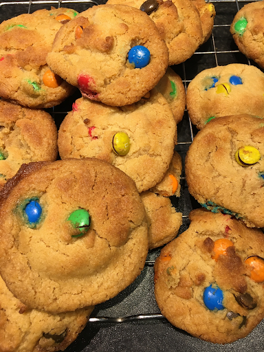

# Smartie Cookies

Makes 11
## Ingredients
* 100g of butter, softened
* 100g of light muscovado sugar 
* 1 tbsp of golden syrup
* 150 self raising flour 
* 85g of smarties (around 3 tubes) M&Ms work just as well
  
##Method
1. Preheat the oven to 180 degrees 
2. Beat the butter and sugar in a bowl until light and creamy then beat in the syrup. This can be done with a whisk or a spoon
3. Work in half the flour. Do this with a spoon
4. Stir in the smarties with the remaining of the flour 
5. Work the dough together with your fingers 
6. Divide them into 11 balls and place them far apart on trays 
7. Do not flatten them and bake them for 9/10 minutes until pale golden at the edges. They cook very quickly at the end
8. Leave them on the trays for 2 minutes so they can cool down a bit before transferring them, otherwise they will disintegrate.
9. Cool on a wire rack
