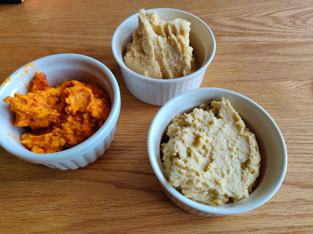

# Hummus

## Ingredients
* Tahini (linseed paste)
* Dried chickpeas (soaked overnight)
* Jalapenos
* Chilli flakes/powder
  
## Method
1. Add Tahini and chickpeas into food processor and mix
2. Mix in spices as desired. Fairly tasteless on it’s own, Jalapenos was great. Chilli was great. Use whatever you want to flavour it.
3. Serve with Pita bread, salad, breadsticks...etc.
